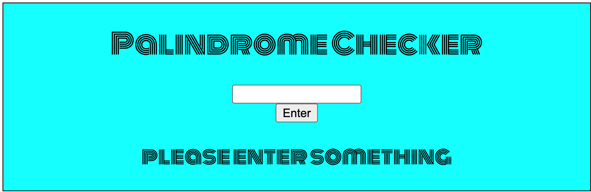
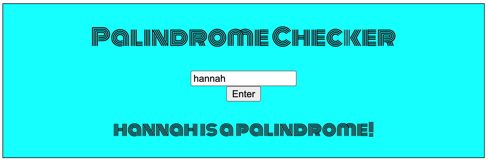
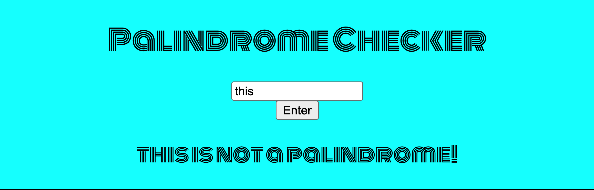

# Palindrome Checker

A server-side palindrome checker built with Node.js.
User enters a word or pharse, then it would tell you is it a palindrome or not.


- How it looks like:





## How It's Made

**Tech Used:** HTML, CSS, JavaScript, Node.js

The server is built with Node's core `http` module and uses the `fs` module to read and serve the HTML, CSS, and JS files. 
The palindrome validation runs on the server, and the result is sent back to the browser to display.

## Getting Started

1. Clone this repository

```bash
   git clone https://github.com/sabrinalindev/palindrome.git
   cd palindrome
```

2. Start the server

```bash
   node server.js
```

3. Open `http://localhost:8000` in your browser

## How to Play

1. Type a word or phrase into the input box (e.g. `tacocat`)
2. Submit it
3. The server checks the string and returns whether it is a palindrome
4. The result is displayed on the page

## Features

- Server-side palindrome validation
- Instant result displayed on the page
- Lightweight Node.js server with no external frameworks

## Optimizations：

-  Improve the visual design
-  Deploy the server online (e.g. Render, Vercel)
